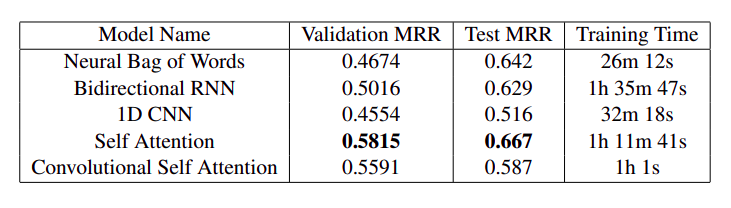

# CodeMantic - Semantic Code Search

## Goal
Given a natural language query, semantic code search is the task of retrieving relevant code which performs the function that is expressed via the mode of natural language query. This task has been proven to be quite important for day-to-day software development and maintenance activities. However, existing code search mechanisms do not take into account the underlying semantics of the code such as program structure and control flow, which is mainly the reason of why a code works how it works. Here, we implement few models which do the task of semantic code search and present the evaluation results based on widely used metric Mean Reciprocal Rank (MRR)

## Usage
 ```
 pip install -r requirements.txt
 ```
  In order to run the 5 models namely:

  1. Neural Bag of Words
  2. 1D CNN
  3. Bidirectional RNN
  4. Self Attention
  5. Conv Self Attention
                
  ```
    bash main.sh
  ```

## Results

  

## References
- https://guxd.github.io/papers/deepcs.pdf
- https://arxiv.org/pdf/1909.09436.pdf